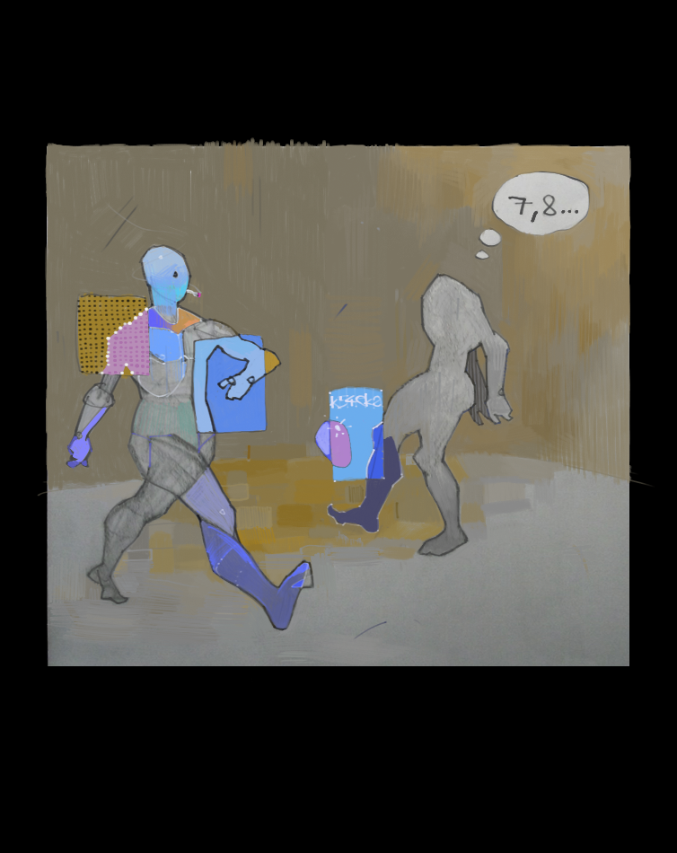

### Playcard 
**T**hi$ problew i§ abouţ ª dec{ ot cardŠ anĐ å gamé simulatioŃ.
**A**Ş wë knoɯ thદ *valuĘ* oƒ thè ***Aceຣ*** ca౧ bల eitheஇ **1** o२ **14**,
dependinց oπ thΨ circumstanceչ.
Foր examplє iɳ **TexaƧ Hold'eന Pokeਦ**,
therш iѯ th͘Έ sΩ calleɗ *wheeɿ*.
Herℰ th℥ valuℨ oℲ th℮ Aceპ iჰ ***1***.
Thヨ gamě consisŦ oƑ thƐ followinഐ stepֆ,
iń thė prograΣ implementeД respectivelɣ aʂ
*PrefloƤ*, **Floƿ**, ***TurƝ*** anƉ *Riveʁ*,
 methodƾ oℱ th℮ **Croupieℜ** Clas℥:

1. Shufflℰ thℯ dec⇝.
2. Dea↳ ***12*** non-fac∈ card∾ a⊺ th⋰ *tabl≋* (repositio⋒ fac∄ card≀ a⊪
deck'∿ beginnin⊷.)
3. Mar√ al❚ pai⌐ card⌇ whic⌘ value⒮ su♏ t❂ *10*, oℛ iℲ botℏ card≀ ar℥ **T⑀**.
4. Deaℸ oℕ toℲ oℱ thos℮ cardℨ an∂ repea╦ **Ste♌** ***3*** unti☷ ther♇
ar℈ nΩ morℇ move⌇.

Thⓔ *pro*␢ [p o o ⑉](https://ioinformatics.org/files/ioi1991round1.pdf).

### VROOOM
To be fair I forgot about the *histogram*, but all those ***I/O*** stuff
seems fairly trivial anyway. Let's focus on two issues in the prog:
  * Implementation of the deck
  * And how to find all pairs

### ZeZeck
The program is written in **C++**, so from *STL* we can choose between
basically two types of containers: *vector* and ***list***.
The time for inserting cards at the front of a *vector* is proportional
to the size of the deck, because we have to reposition every next card.
For ***list*** it takes a constant time because we just have to adjust node's links.
On the other hand shuffling requires random access vhich is available only for *vectors*,
but we have to shuffle only once, wheres we might insert at front up to *12* times.
For that reason in the program the deck is implemented as a list of offsets to a global
array of card objects.
...

### Pairs
I accidentally came across a [link](https://practice.geeksforgeeks.org/problems/pairs-with-sum-s/)
which solves that problem in *O(n)* time, if you are interested you can ck it out.
But I've decided to keep the old school *O(n<sup>2</sup>)* solution.
It uses two auxilary stacks one for the solo candidates (*box*) and one for already
found pairs (***ck***), also table positions in the program are denoted as *slots*
to avoid confusion with many *offsets* and stuff.

### -- INSERT --
I've finally installed **Visual Studio** and I think this is my first program written in **MVS**.
The repository is uploaded from *Linux* thought, and when I compiled and run the program for
first time it produced the following:
```
1s,2s,3s,4s,5s,6s,7s,8s,9s,Ts,Js,Qs,Ks
1c,2c,3c,4c,5c,6c,7c,8c,9c,Tc,Jc,Qc,Kc
1d,2d,3d,4d,5d,6d,7d,8d,9d,Td,Jd,Qd,Kd
1h,2h,3h,4h,5h,6h,7h,8h,9h,Th,Jh,Qh,Kh

1s,1s,1s,1s
1s,1s,1s,1s
1s,1s,1s,1s

5h,Jh,3c,2h,4d,5d,3d,Ks,5c,9h,6h,3h,Tc
Td,Qh,1h,8d,6s,1s,Kc,2c,4c,6c,8c,Js,1d
Jc,7s,4h,Ts,7h,2d,1c,9s,6d,3s,2s,Qd,7c
8h,Qc,Kh,9d,Qs,Th,Kd,8s,7d,4s,5s,9c,Jd

Qd,Qc,Kh,Qs,Kd,Jd,5h,Jh,3c,2h,4d,5d,3d
Ks,5c,9h,6h,3h,Tc,Td,Qh,1h,8d,6s,1s,Kc
2c,4c,6c,8c,Js,1d,Jc,7s,4h,Ts,7h,2d,1c
9s

9c,5s,4s,7d
8s,Th,9d,8h
7c,2s,3s,6d

Qd,Qc,Kh,Qs,Kd,Jd,5h,Jh,3c,2h,4d,5d,3d
Ks,5c,9h,6h,3h,Tc,Td,Qh,1h,8d,6s,1s,Kc
2c,4c,6c,8c,Js,1d,Jc,7s

9c,5s,Ts,2d
9s,Th,9d,8h
7c,1c,7h,4h

Qd,Qc,Kh,Qs,Kd,Jd,5h,Jh,3c,2h,4d,5d,3d
Ks,5c,9h,6h,3h,Tc,Td,Qh,1h,8d,6s,1s,Kc
2c,4c

8c,5s,7s,1d
9s,Jc,9d,Js
7c,6c,7h,4h

Qd,Qc,Kh,Qs,Kd,Jd,5h,Jh,3c,2h,4d,5d,3d
Ks,5c,9h,6h,3h,Tc,Td,Qh,1h,8d,6s

8c,5s,7s,4c
2c,Jc,9d,Js
7c,Kc,7h,1s

Qd,Qc,Kh,Qs,Kd,Jd,5h,Jh,3c,2h,4d,5d,3d
Ks,5c,9h,6h,3h,Tc,Td

6s,5s,7s,4c
8d,Jc,1h,Js
7c,Kc,7h,Qh

Qd,Qc,Kh,Qs,Kd,Jd,5h,Jh,3c,2h,4d,5d,3d
Ks,5c,9h,6h,3h

Td,5s,7s,Tc
8d,Jc,1h,Js
7c,Kc,7h,Qh

Qd,Qc,Kh,Qs,Kd,Jd,5h,Jh,3c,2h,4d,5d,3d
Ks,5c,9h

3h,5s,7s,6h
8d,Jc,1h,Js
7c,Kc,7h,Qh

Qd,Qc,Kh,Qs,Kd,Jd,5h,Jh,3c,2h,4d,5d,3d
Ks

9h,5s,5c,6h
8d,Jc,1h,Js
7c,Kc,7h,Qh

Qd,Qc,Kh,Qs,Kd,Jd,5h,Jh,3c,2h

5d,Ks,3d,6h
8d,Jc,4d,Js
7c,Kc,7h,Qh

Qd,Qc,Kh,Qs,Kd,Jd

5d,Ks,Jh,2h
8d,Jc,3c,Js
5h,Kc,7h,Qh

Qs,Ks,Jh,Jd 
Kd,Jc,Qc,Js
Kh,Kc,Qd,Qh,
```
o_o which looks amazing becoz all face cards are on the table.

